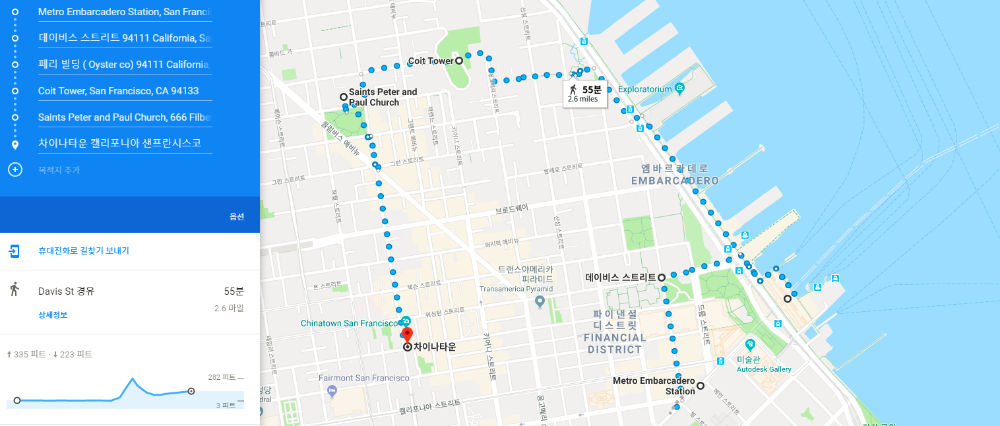

- TEAM NAME : ALPHA TEAM 
- LEADER : GAEUL GO
 
## CONTENTS 
- finding 'MEET UP' and participating 
- group, individual freely

*** 

## The Fist SV_EXPERIENCE
### Title : _Walking Tour of the Northeast San Francisco_
### Date and Time : Saturday, 06 Jan 2018, 10:40 am ~ 15:00 pm 
### Place : the Northest San Francisco
### Attendants : Alphateam(Gaeul Go, Minjun Koo, Hwancheol Kang, Giheyon Yang) Quadcore(Seungwoo Jeong, Hyeongguen Eom, Minjun Cha, Seunghwan Hong), ChangHeon Song
### Route

1. Metro Embarcadero Station
2. Davis St.
3. Ferry Building
4. Coit Tower
5. Saints Peter and Paul Church
6. Chinatown

### Route 1. Metro Embarcadero Station
#### We arrived at Embarcadero station about 40 minutes after departing from Arleta station.
