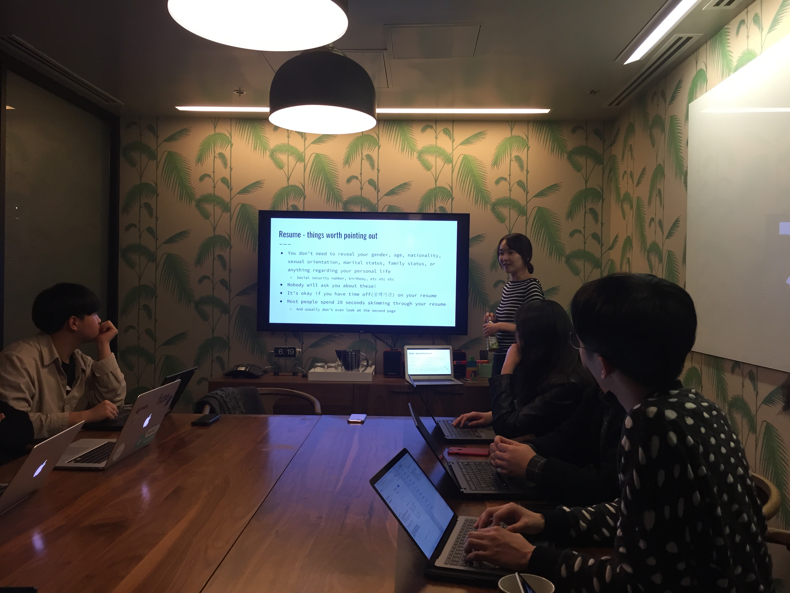

January 5th Friday

## 1st Week (January 5th Friday)
- SPEAKER : *SOO HYEON LEE* 
- QESTION LIST   

***

**Q1.** We're curios about vacation system. We wonder if the number of times I can use in a year is fixed like Korea and I am free to use it.    
**Ans** : Case by case. In many cases, There are constraints depending on the situation   

***

**Q2.** How long does it take employees to get a maximum rest without quitting their jobs? Because it takes a relatively long time if we go to Korea once.  
**Ans** : 3 Months (Google)   

***

**Q3.** Do the employees take an exam after joining the company?
(example. Level test.) 
**Ans** : None.   

***

**Q4.** How about weight of responsibility if the project is not performing well after taking the project for several months? 
**Ans** : Failure is also valued. Explain the reason for the failure and investigate it in detail. It is important not to make the same mistake. It is considered as important value to go in a productive direction.  

***

**Q5.** Do employees receive training after joining?  
**Ans** : Case by case. Most companies put new employees directly into the field. Orientation(Google)  

***

**Q6.** When you're working in project, you will have at least 2 code reviewer. If your project implements code in different languages, how do your team review the code? 
**Ans** : Usually one team uses the same language.  

***

**Q7.** What are the competencies required of PM in Google? 
**Ans** : Technical background, Speaking ability, Insight   

***

**Q8.** Google also have a mentoring system 
**Ans** : There is no such system in the company itself.  

***

**Q9.** What difference does it make when entering a company's internship and entering a full-time job? 
**Ans** : Interns work same. If you do not identify yourself as an intern, people think you are the same engineer.  

***
{: width="50%" height="50%"}

{: width="50%" height="50%"}