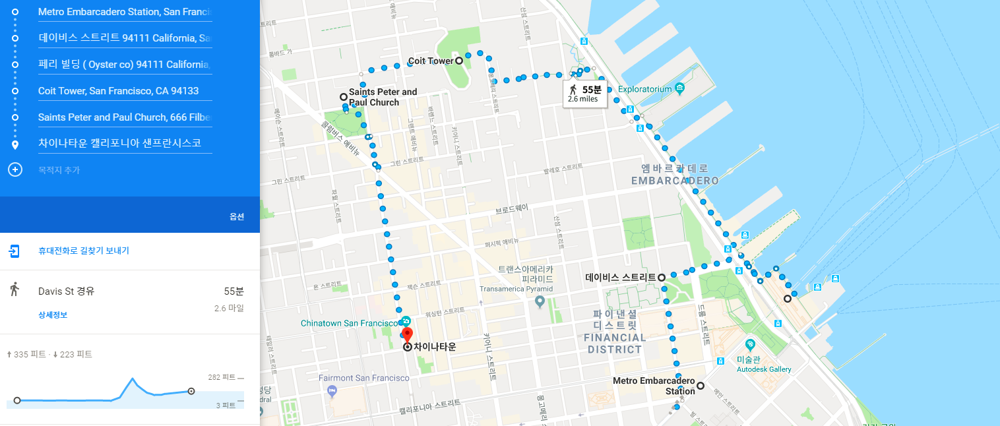
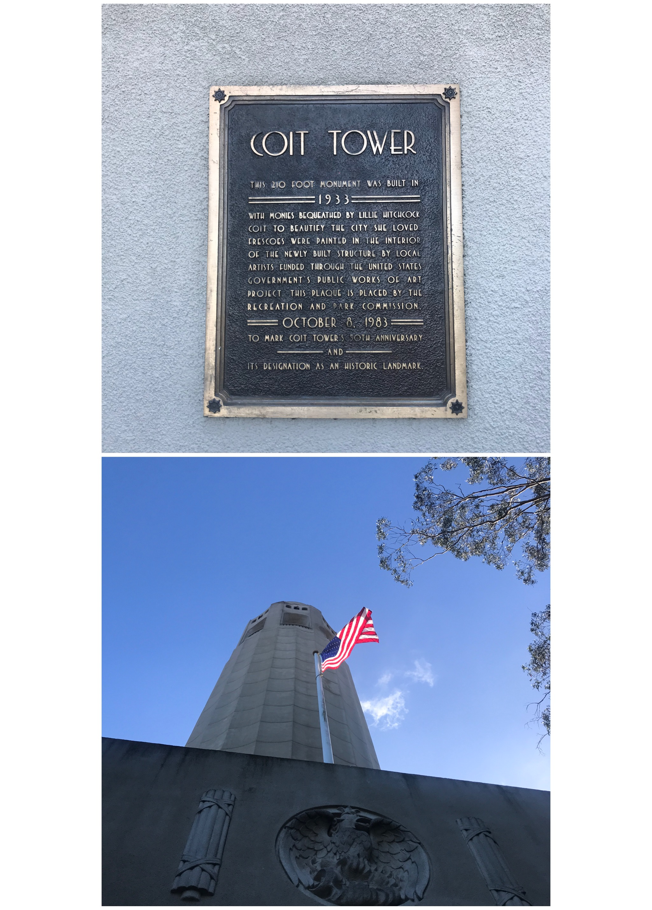

- TEAM NAME : ALPHA TEAM 
- LEADER : GAEUL GO

--- 

## The Fist SV_EXPERIENCE
### Title : _Walking Tour of the Northeast San Francisco_
### Date and Time : Saturday, 06 Jan 2018, 10:40 am ~ 15:00 pm 
### Place : the Northest San Francisco
### Attendants : Alphateam(Gaeul Go, Minjun Koo, Hwancheol Kang, Giheyon Yang) Quadcore(Seungwoo Jeong, Hyeongguen Eom, Minjun Cha, Seunghwan Hong), ChangHeon Song
### Route

1. Metro Embarcadero Station
2. Davis St.
3. Ferry Building
4. Coit Tower
5. Chinatown

### Route 1. Metro Embarcadero Station

* We arrived at Embarcadero station about 40 minutes after departing from Arleta station. The weather was really nice but there was a sea nearby so it was cold.

### Route 2. Davis St.

* Originally, We were going to attend a meetup called 'Walking in San Francisco', so we headed to Davis St. where we started. The sky in San Francisco on the way was so beautiful.
* However, We determined to move as our route because their moving speed was slow.

### Route 3. Ferry Building

* We walked to the Ferry Building, the closest tourist attraction from our current location.
* Fortunately, there is a Farmers Market around the Ferry Building every Saturday. We saw fresh fruits, homemade cakes, and coffee made from their own coffee beans.

* We also walked 'pier 7'. It was a really long bridge and we could see the wide sea at a glance. We were able to breathe in clean air and felt good to smell the roses.

### Route 4. Coit Tower

* After having lunch, we started walking again. There are so many slopes to the Coit Tower. However, the beautiful landscape was seen when we loop back and it kept us going up high. 

* After walking through many sloping places and stairs, we finally arrived at the coit tower. We could see all of the northeast San Francisco including Golden Gate Bridge and Alcatraz Island. We thought we can go there someday.

### Route 5. Chinatown 

* After stopping at Saints Peter and Paul Church, we finally headed for chinatown. We went to Chinatown, the second largest city in the world after New York, and we really felt like we were traveling in China. We also felt we did not need to go to China. 
