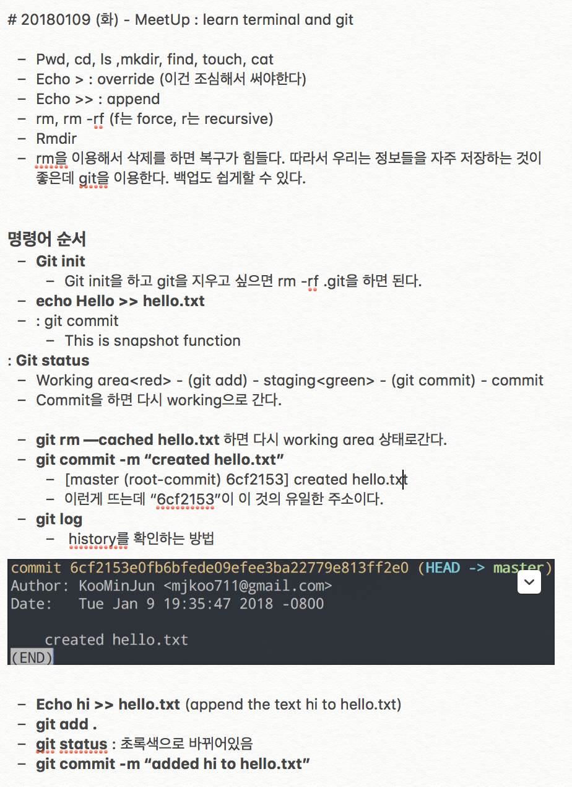
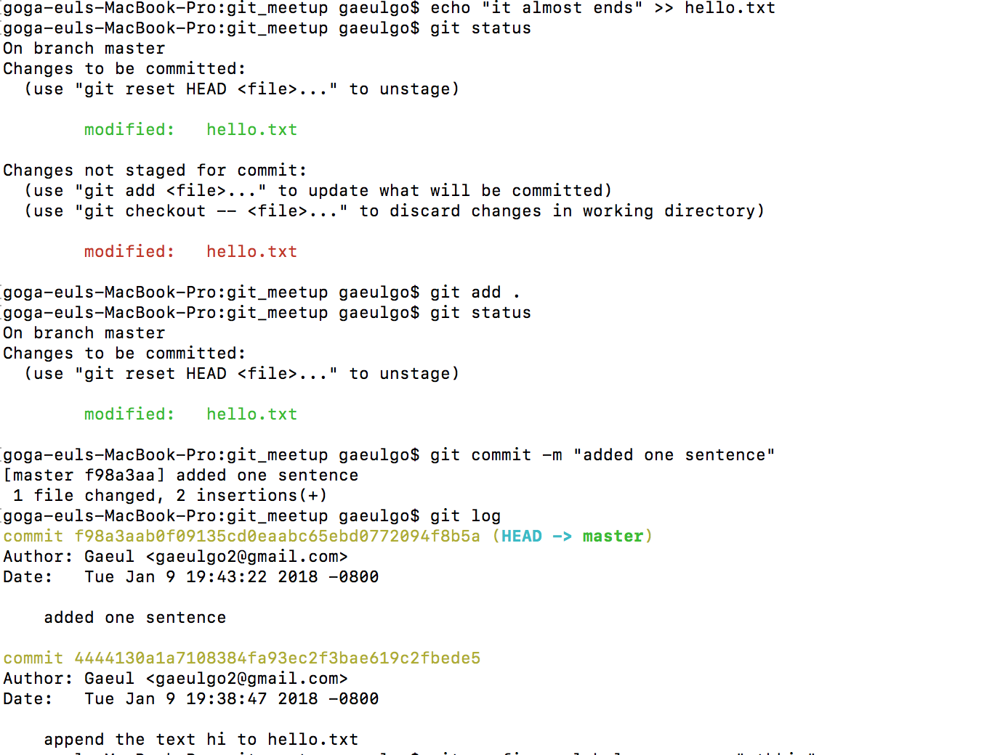

- TEAM NAME : ALPHA TEAM 
- LEADER : GAEUL GO

## The Second SV_EXPERIENCE
- Title : _Work Like a Developer : Intro to Terminal & Git_
- Date and Time : Tuesday, 09 Jan 2018, 18:30 am ~ 20:00 pm 
- Place : the Rithm School
- Attendants : Alphateam(Gaeul Go, Minjun Koo, Hwancheol Kang, Giheyon Yang), Seungwoo Jeong, Hyeongguen Eom

### The contents we learn 

* First, we learn the terminal. It was easy for us because we had already used the terminal just 10 minutes (10 minutes takes from WeWork to Rithm School) ago. As we can see from the Koo's notes above, 'pwd', 'cd', 'find', 'touch', 'cat' are already familiar command for us. 
* Nevertheless, it was good to study to review the basic commands. Besides, this lecture is conducted in English. We learned what we already know in Korean, so we could concentrate on the lesson.

* When we had a question about how to learn terminal and Git in an hour and a half, the speaker who was explaining "rm" said, "If you delete it using rm, it is hard to recover. I use Git to do that, and I can easily back up. " 

* Using the basic commands we learned earlier, we learned to start Git with 'git init', and remotely manage git by adding and changing files. We were using Git while We were working on a team project, and We were able to understand each command with a lecture. 
* 'git add'

