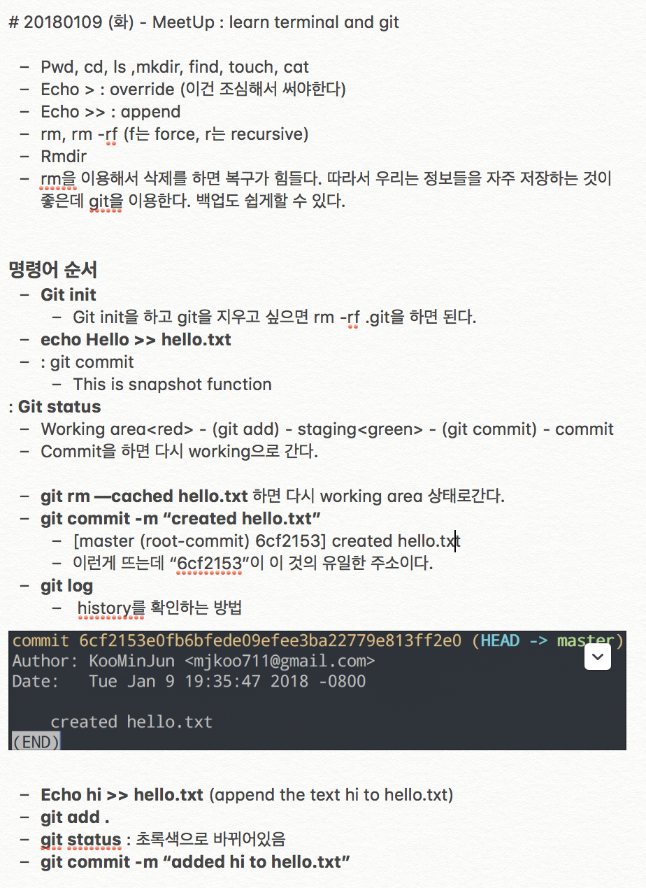
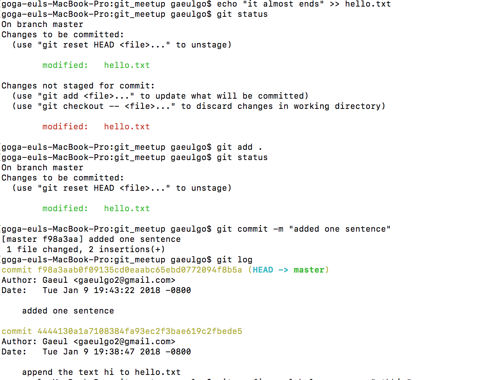

January 9th Tuesday

## The Second SV_EXPERIENCE (January 9th Tuesday)
- Title : _Work Like a Developer : Intro to Terminal & Git_
- Date and Time : Tuesday, 09 Jan 2018, 18:30 am ~ 20:00 pm 
- Place : the Rithm School ([rithmschool](http://www.rithmschool.com).)

- Attendants : Alphateam(Gaeul Go, Minjun Koo, Hwancheol Kang, Giheyon Yang), Seungwoo Jeong, Hyeongguen Eom

### The contents we learn 

* First, we learn the terminal. It was easy for us because we had already used the terminal just 10 minutes (10 minutes takes from WeWork to Rithm School) ago. As we can see from the Koo's notes above, 'pwd', 'cd', 'find', 'touch', 'cat' are already familiar command for us. 
* Nevertheless, it was good to study to review the basic commands. Besides, this lecture is conducted in English. We learned what we already know in Korean, so we could concentrate on the lesson.

* When we had a question about how to learn terminal and Git in an hour and a half, the speaker who was explaining "rm" said, "If you delete it using rm, it is hard to recover. I use Git to do that, and I can easily back up. " 

* Using the basic commands we learned earlier, we learned to start Git with 'git init', and remotely manage git by adding and changing files. We were using Git while We were working on a team project, and We were able to understand each command with a lecture. 
* We also learned the git status('git add' , 'git commit', 'git push'). When we ends the working or just want to keep the file, we use 'git add'. By using the commands, file in working directory changes into 'staged'. If the user enters 'git commit', file is committed to local repository. After, we enter 'git push' on terminal, it is pushed to remote repository. Also the state changes into 'unstaged'. 
* It is really basic, but it was a good opportunity to understand and use git and github.

[ What we felt ? ]

* Gaeul Go : I thought it was hard to listen the lecture because I did project all day. Unlike what I expected, it seemed to be a great help because the lecturer taught the necessary concepts easily, quickly and deeply.
* Hwancheol Kang : Though the lesson covered the basic contents rather than I thought, the lecture's lecture was very good and the students were enthusiastic. 
* Minjun Koo : Today I had a basic lecture in English about terminal, git and github. I was working in the school to tell the 1st grade students how to use the terminal, so I think it will help me a lot. Besides, it was good to know the new functions I didn't know. I did not know why I was using git before this meet-up and I thought I was only using it when I was collaborating. It was a good meet-up to see why I use git.
* Gihyeon Yang : It was a lecture more than I expected to get from the idea of reviewing the knowledge I originally knew.

