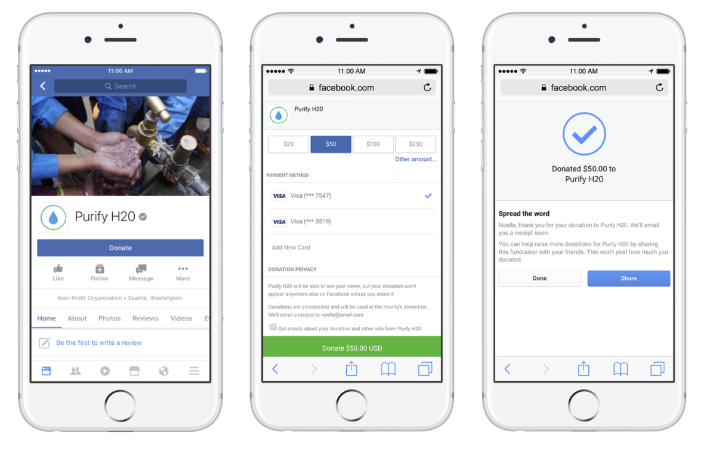
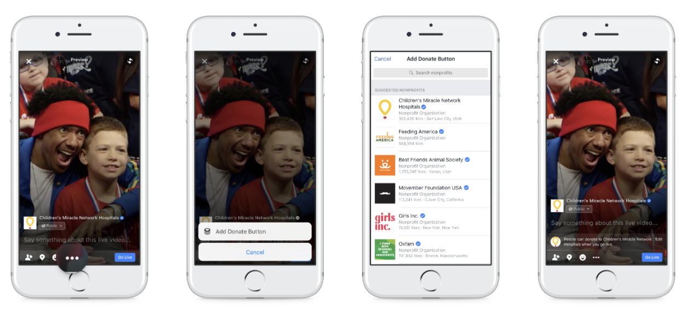
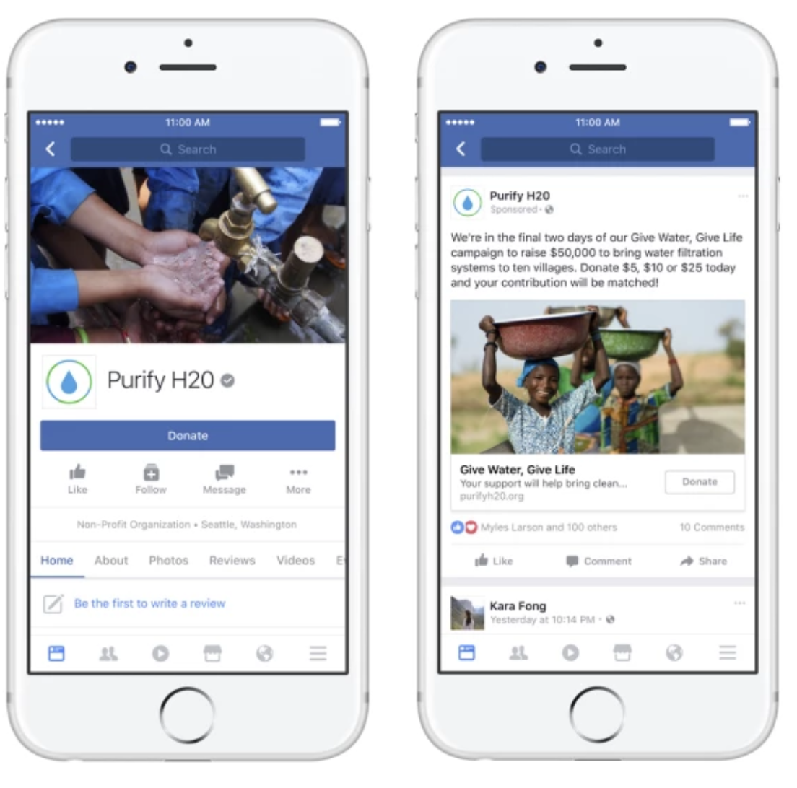

January 10th Wednesday

## Meeting Contents #02

- We thought of some ideas for two days.
- **Minjun** says,
  - Facebook's values : "The World is One"
  - In Korea, the Facebook groups "I will deliver your message" are famous.
  - However, in a page frame, the administrator manually checks all the messages and posts them manually.
  - It would be nice to have the ability to easily post it to posts when the message arrive.    

- **Gaeul** says,
  - I would like to be able to set an alarm for the videos that have already been uploaded so that the videos can be viewed at that time.
  - For example, suppose you take a bus every morning at 8:00 am and watch some english conversion video on YouTube. Then you want the alarm to ring to watch the videos of the subscribed channels every morning at 8:00 am.    

-	**Hwancheol** says,
  -	I would like Youtube to have the ability to introduce tourists to surrounding tourist attraction based on their location.    

-	**Gihyun** says,
  -	I hope Google Maps will provide travelers with the ability to return to a safe route.        

- But the ideas the team members presented were not attractive enough.

- When everyone said they had no idea, Gihyun announced a good idea for Facebook.

- 페이스북에는 [Nonprofits on Facebook]("https://nonprofits.fb.com/") 이라는 기부를 위한 시스템이 존재한다.

  - 현재 페이스북에서는 페이지를 통한 기부와 라이브 비디오를 통한 기부를 할 수 있다.

    -페이지 게시물에 기부 버튼을 추가하여 사람들이 Facebook 어플 내에서 기부할 수 있다.
      -   

    -라이브 비디오에 기부 버튼을 추가하여 사람들이 Facebook 어플 내에서 기부할 수 있다.
      -   
    
  - 페이스북 광고에서 기부금을 쉽게 모으고 싶으면 기부 버튼을 추가할 수 있다.
      -     

- **그러나 페이스북의 기부는 자신의 돈을 지불하는 방식으로만 진행이 된다.** 사용자들이 자신의 돈을 직접 지불하지 않고 기부에 도움이 되는 방법은 없을까?  한국에는 네이버에서 운영하는 "해피빈"이라는 온라인 기부 포털이 있다. 이 포털은 "콩"이라는 크레딧으로 기부를 한다. "콩"은 돈을 주고 구매를 할 수 있지만, 네이버에서 블로그 활동과 카페 활동 등으로 얻을 수 있다. 그리고 유저들은 자신의 돈을 들이지 않고도 기부를 할 수 있다.    

  

- 이러한 방식을 페이스북에 어떻게 적용시킬 수 있을까? 우리는 사용자들이 페이스북에 가지는 불만 중에서 "수 많은 동영상 광고"를 이용하기로 생각해보았다.

  - 동영상 광고를 끝까지 시청한다면 "콩"같은 크레딧을 사용자에게 제공하는 것이다. (단, 이 크레딧은 오로지 기부에만 사용된다.)

  - 사용자는 그렇게 얻은 적은 크레딧들을 모아서 기부에 참여할 수 있다. 기부를 하는 방법은 "좋아요" 버튼처럼 쉽게 누를 수 있는 "기부하기" 버튼을 만드는 것이다.

  - 사용자의 프로필에는 "어느 단체에 기부를 했다."라는 문구가 뜰 수 있다.

  - 물론 사용자가 직접 크레딧을 구매해서 기부를 할 수도 있다.    

 

- 하지만 모든 동영상 광고에서 제공을 하는 것이 아니다. 페이스북과 협의가 된 회사만이 이 기부문화에 참여할 수 있다. 대신 그 회사의 동영상 광고가 시작될 때, "우리 회사는 기부문화에 참여하고 있습니다. 끝까지 시청하시면 크레딧을 얻을 수 있습니다." 라는 문구를 띄워줌으로써 알려준다. 그러면 그 참여 회사의 이미지도 올라갈 수 있다.    

 

- 우리는 해피빈의 장점을 가져와서 페이스북에 적용시키려 하였다. 하지만 해피빈에도 단점이 있었다.

  - 첫번째, [네이버](https://www.naver.com) 내에서 해피빈을 이용하는 것이 아니라, [다른 사이트](https://happybean.naver.com) 로 접근을 해야한다. 

    -그러나 페이스 북은 사용자가 가장 자주 이용하는 타임라인에서 곧바로 기부를 할 수 있다.
  - 두번째, 광고를 가장한 켐페인이 있다는 것이다.

    -이 것은 더 많은 회의를 거쳐 보완방법을 알아보겠다.    

- 페이스북에도 Nonprofits on Facebook이라는 기부기능이 있기 때문에 이 것을 좀 더 보완시켜 기부문화를 더 활성화시킬 수 있으면 좋을 것 같다. **Let's turn users' complaints about Facebook ads into merits.**    

- 이 아이디어를 태훈님, 선희님과 이야기 해보았다.
  - 태훈님
    - 좋은 아이디어다. 하지만 Facebook은 기업이기 때문에 기업이 얻는 이익에 대해 좀 더 조사할 필요가 있다.
    - 이런 서비스를 제공했던 다른 기업에 대해서도 더 분석하여 보완하면 좋겠다.
    - 마켓 리서치에 대한 조사도 이루어지면 좋겠다.
    - 우리의 아이디어에 대해 팀원 4명에서 2명은 장점에 대해서만, 2명은 단점에 대해서만 조사하는 것도 좋을 것이다.
  - 선희님
    - 페이스북의 단점으로 꼽히는 수많은 광고들을 장점으로 승화시킬 수 있는 좋은 아이디어다.

