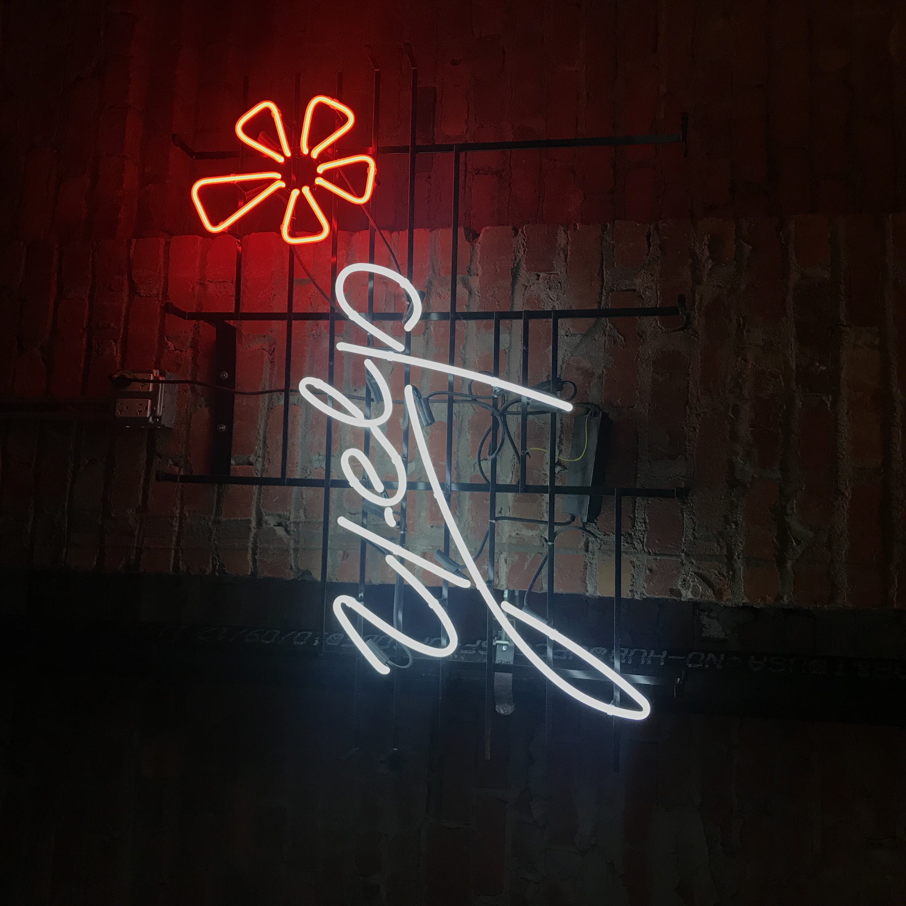
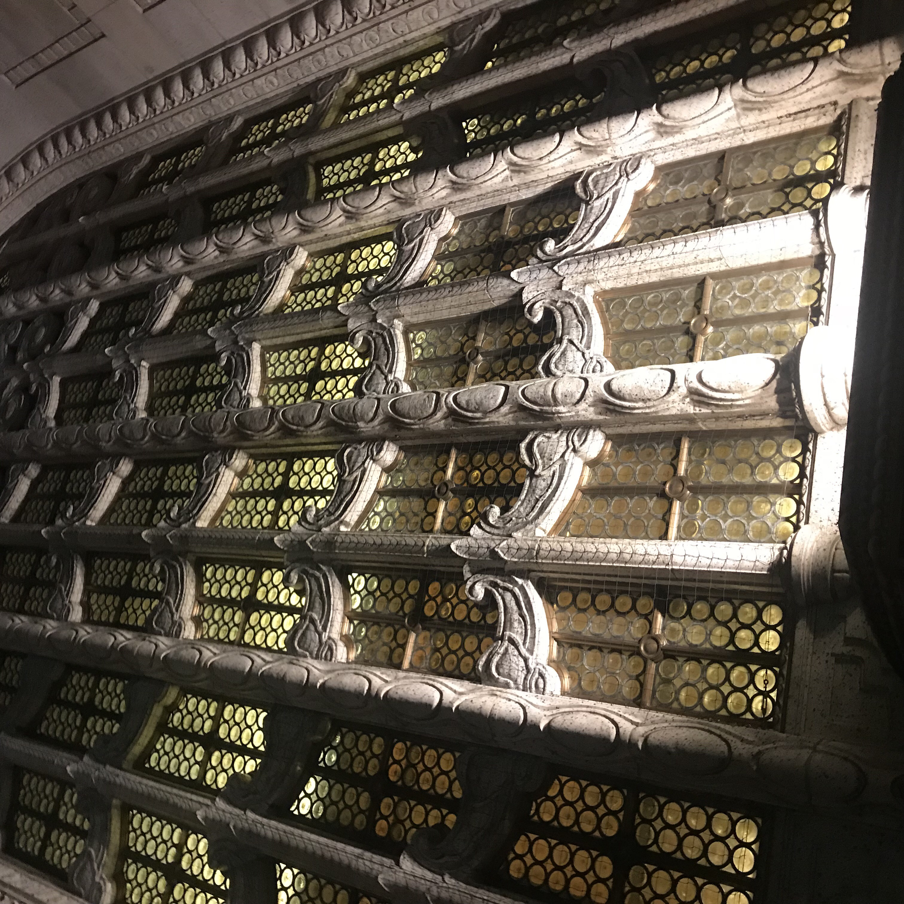
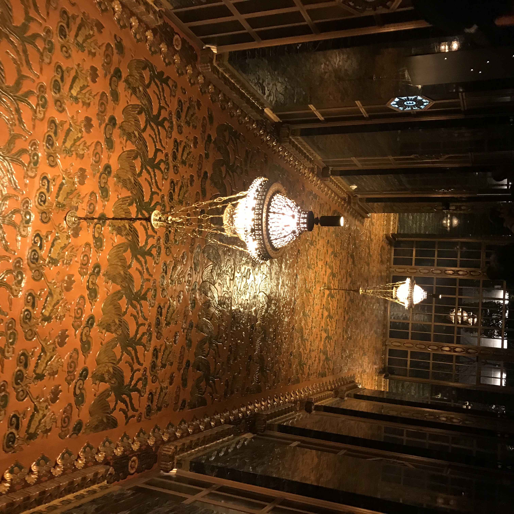
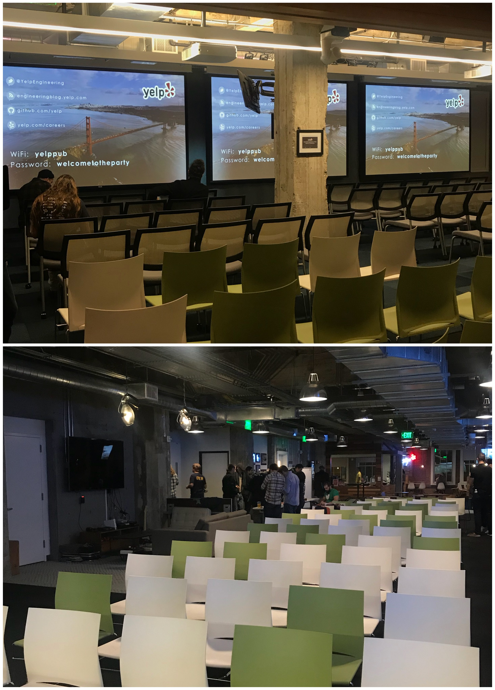
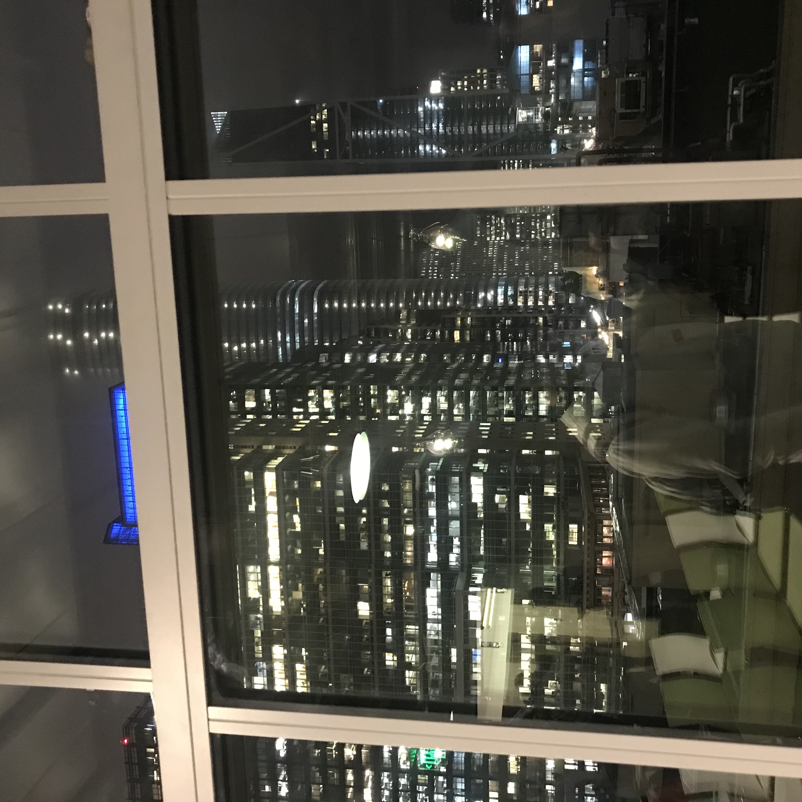
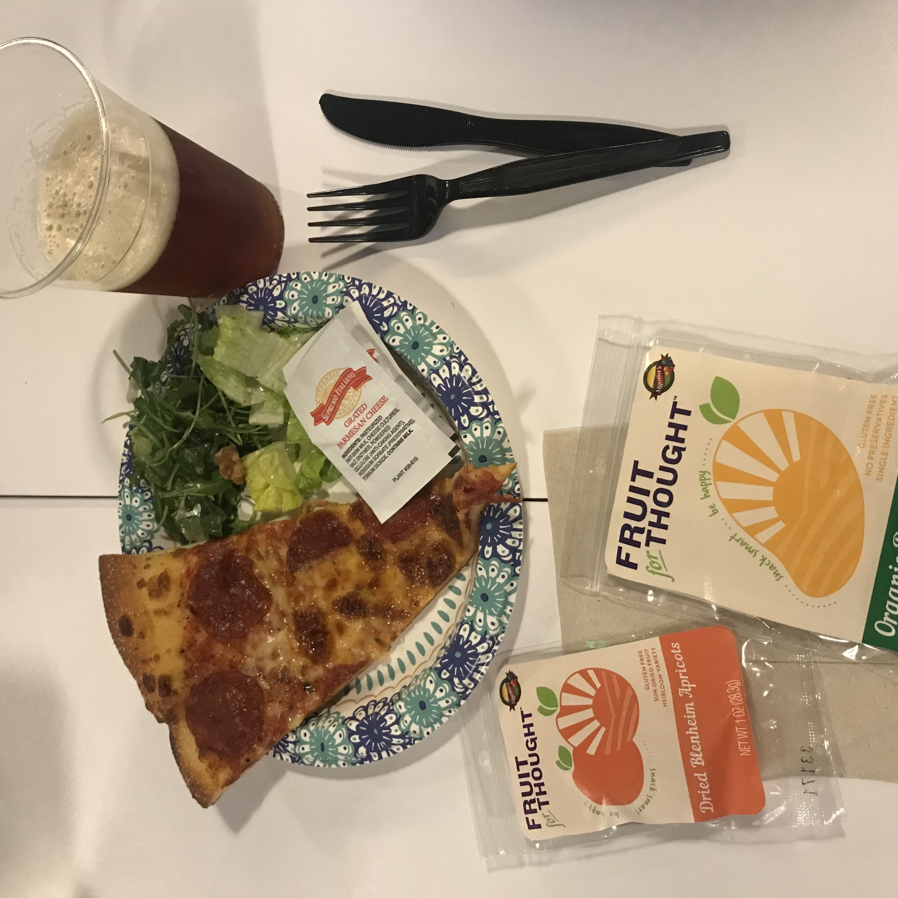
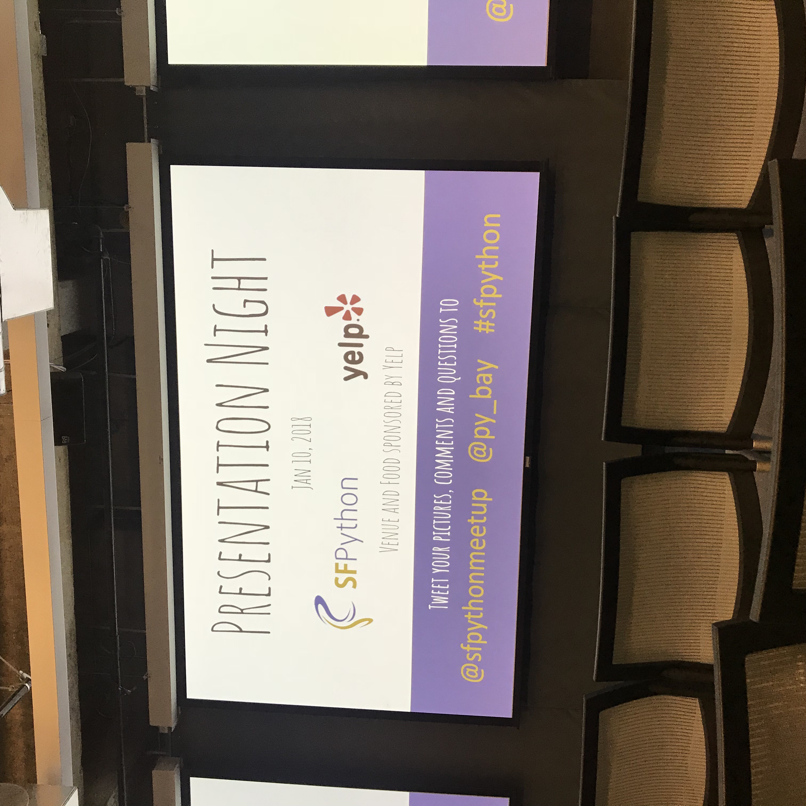
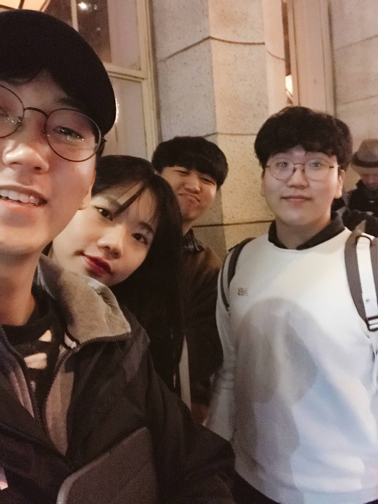

January 10th Wednesday

## The THIRD SV_EXPERIENCE (January 10th Wednesday)
- Title : _Learn about Python3 and MUCH MORE_ ( Subtitle : Yelp tour )
- Date and Time : Wednesday, 10 Jan 2018, 18:00 pm ~ 20:20 pm 
- Place : YELP

- Attendants : Alphateam(Gaeul Go, Minjun Koo, Hwancheol Kang, Giheyon Yang)

### The contents we did 

* When we got off the car, we were hard to find where the Yelp building was. We could find the yelp building after seeing the long line and the person wearing the 'Yelp' hoodie. Subsequently, we were surprised to see the exterior. The building was magnificent and the design was very delicate.

* After we had an ID check, we got inside the building. Then we all thought we were good to come. The interior also beauriful.

* We went to the 8th floor and it was really wide.
* We thought the start time was 6 o'clock, but it was the entry time. So we had enough time to eat pizza and beers.

* Yelp provided us pizza, salad, beer, beverage and snacks.

[ Program Order ]
1. Lightning Talks ( 5 mins )
- About going Open-Source
- Promoting Sex Worker Led Health Initiatives with Python
- Tonight we won't be talking about caching

2. Short Talk ( 10 mins + Q & A )
- Migrating Python.org to Buildbot 9 and Python 3

3. Main Talk ( 30 mins + Q & A )
- Python 3 at Lyft

* Actually, it was hard to understand everything. However, we felt there are many people interested in development using Python, and they made Python more available and more advanced.

[ What we felt ? ]

* Gaeul Go : Our alpha team is also using Python. It is very attractive language in the way that it is able to translate  what people think. Also, I felt it will be interesting to develop buildbot9.
* Hwancheol Kang : The people were kind and the atmosphere was so good that I wanted to go again. 
* Minjun Koo : I enrolled to study Python, but it was about the development using Python they are developing or already developed. The contents were difficult, but I had a good time to speak English with other people before the start of the lecture.
* Gihyeon Yang : The atmosphere was definitely different from the las meet-up. I have also experienced an unfamiliar person approaching and talking. I couldn't understand enough because the presentation was fast, but it was a good experience to hear a little bit about the lyft's development method.

