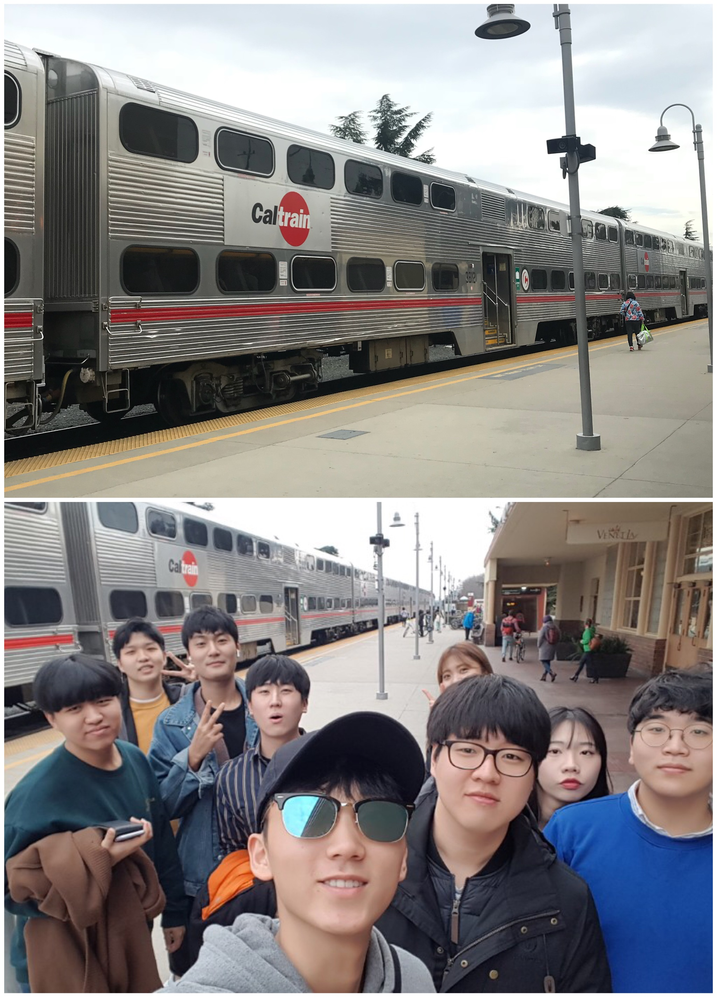
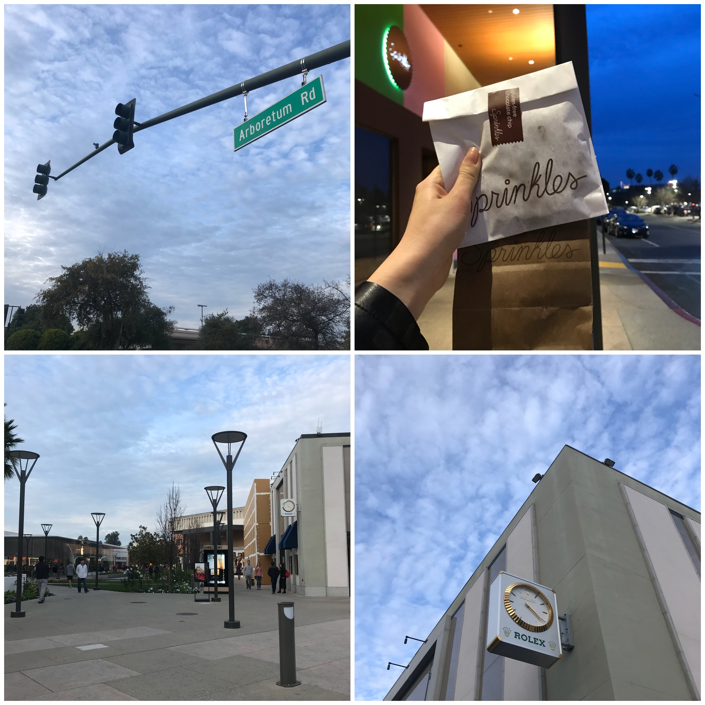

January 14th Saturday

## The FOURTH SV_EXPERIENCE (January 14th Saturday)
- Title : _Stanford Tour_
- Date and Time : Saturday, 14 Jan 2018, 10:30 am ~ 19:00 pm
- Place : near Palo Alto Station and Stanford
- Attendants : Alphateam(Gaeul Go, Minjun Koo, Hwancheol Kang, Giheyon Yang) Quadcore(Seungwoo Jeong, Hyeongguen Eom, Minjun Cha, Seunghwan Hong), ChangHeon Song

## 1. Cartrain

- We moved by Cartrain and it took about 1 and half hours. 
- We started at 'Bayshore' and arrived at 'Paloalto'

## 2. Walking to the Stanford

- After arriving at the station, we have to walk to the Stanford. 

## 3. Having lunch

- On the way, we had the India food in 'Curry Up Now'. The flavor was different from the curry we eat in our country.
- We drank the 'Mint Mojito' in Philz Coffee for dessert and all of us said 'It was delicious'.

## 4. Stanford Museum ( Iris &B. Gerald Cantor Center for Visual Arts at stanford University )

- In the Rodin Sculpture Carden, we can see 'The Gates of Hell', 'The Burghers of Calasis', and so on.
- Rodin's work is said to have about 50 points inside the museum and 20 points outside. 
- It has the second largest collection of Rodin in the world.
- We also can see the inside of the Museum. It was lucky to see the Rodin's sculpture.

## 5. the campus of Stanford 

- We saw many department building. The building design was delicate and magnificent.
- We also saw the cathedral, and others said that the gold that was decorated here was all real.

## 6. the Stanford shopping center

- There is a shopping center 25 walking away. 
- The shopping center was very clean and it was nice to have lots of space to rest than other shopping center.

