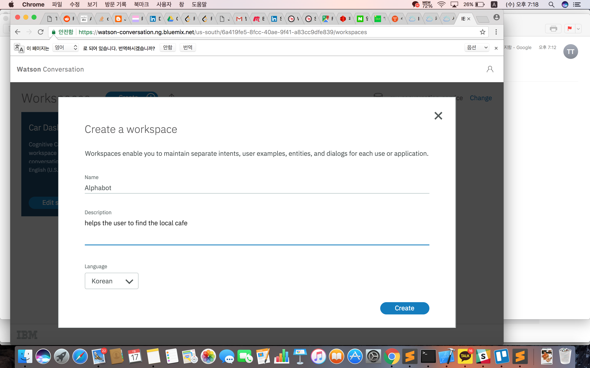
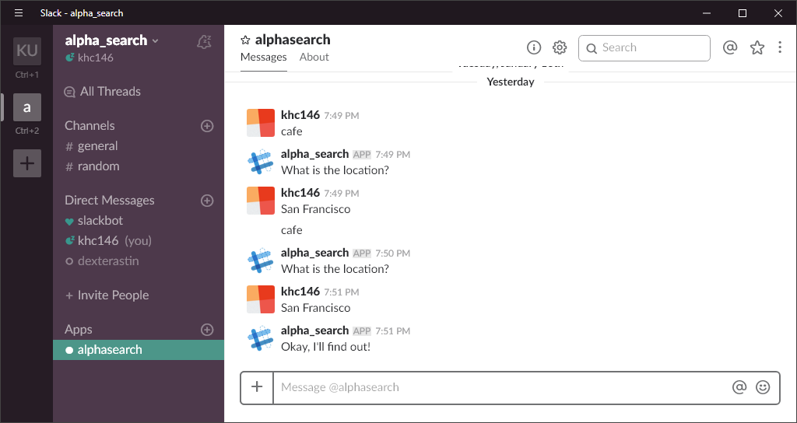
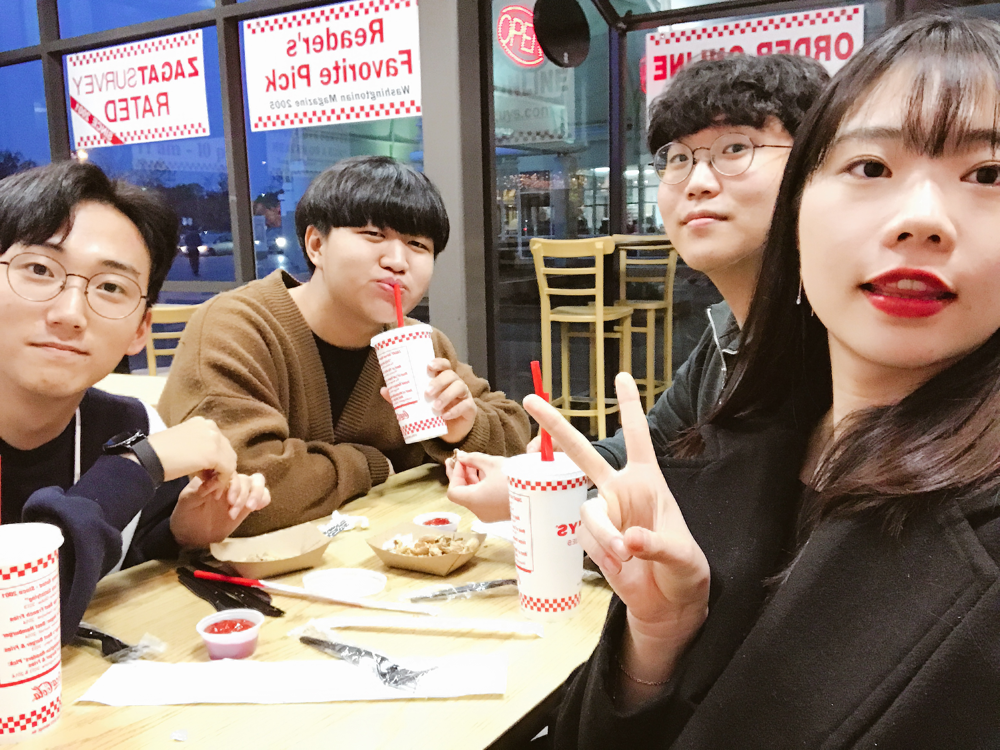

January 17th Wednesday

## The FIFTH SV_EXPERIENCE (January 17th Wednesday)
- Title : _How to build a chatbot_
- Date and Time : Wednesday, 17 Jan 2018, 18:00 am ~ 21:00 pm
- Place : IBM
- Attendants : Alphateam ( GaeulGo, Minjun Koo, Hwancheol Kang, Gihyeon Yang )

## Contents

* Agenda
1. Open Discussion
2. Why Chatbots
3. Cuts of a chatbot
4. Hands-On
5. Follow Up : Topics / Homework

## 2. Why Chatbots?
- It's because automatic solutions are simply more scalable. Besides, its cheaper, more efficient, and often more accrurate than a human. 

## 3. Cuts of a chabot
- Intents / Entites / Dialog
- It's good to be mind these 3 things. 
- Intents : An intent is the goal or purpost of the user's input
- Entities : An entity is a portion of the user's input that you can use to provide a dfferent response to a particular intent.
- Dialog

## 4. Hands-On

* register for ibm cloud : ibm.biz/ibmcloudchatbot
-> my gate way to fall along the lab
* try our code pattern : ibm.biz/chatbot011718
-> the closest lab experience the lab 

- We got a paper written about 'Watson Conversation'. There are several steps to start Chatbot. 
- The first step is 'Desigining your bot'. We have to name the chatbot and what they do. I wanted to apply our project, so I chose 'alphabot' as the chatbot name. And its role is 'to find the local cafe'.
- The second step is 'Train Watson Conversation Service'. I signed in 'IBM Cloud' and I launched the 'watson conversation'.

- I entered the name and create chatbot. Continuously, I created the intent, entity, and dialog. It was hard to understand at first but it gets more interesting as time goes by. Finally, I made my first chatbot, 'Alphabot', and it took only 1 hour.

- We made a chatbot called 'alpha_search'. It was easy to make it because the UI of IBM's conversation is made easy to follow. 

### Talk our Feelings

- Gaeul Go : It was amazed that I can make a chatbot in 1 hour. The level and speed of the lecture was suitable for us. It was an excited experience.
- Minjun Koo : I thought it would be a lot harder because the host is IBM, but I really appreciated it teaching in detail from the beginning. Gaeul leader who picks up the meet-up well is super cool.
- Gihyeon Yang : I have heard a lot of information about the technology actually used in this MVP BOOTCAMP. Of course, we used a platform different from the chatbot platform we used, but the principles and concepts overlap easily.
- Hwancheol Kang : It was uncomfortable because Wi-Fi was not available, but the staff worked well. I felt that the IBM's Watson platform was cleaner and more intuitive than the dialogflow in MVP. Both are the same chatbots, so their usage is similar. I had a lot of questions while dealing with chatbots, and I was able to solve some of them.

