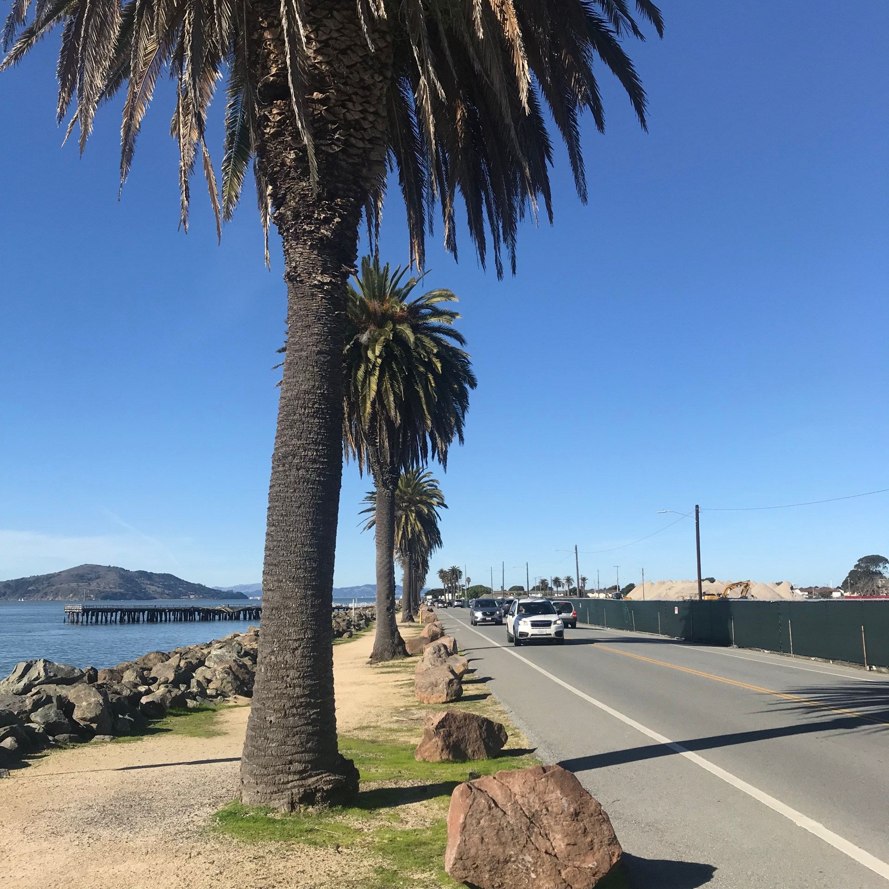
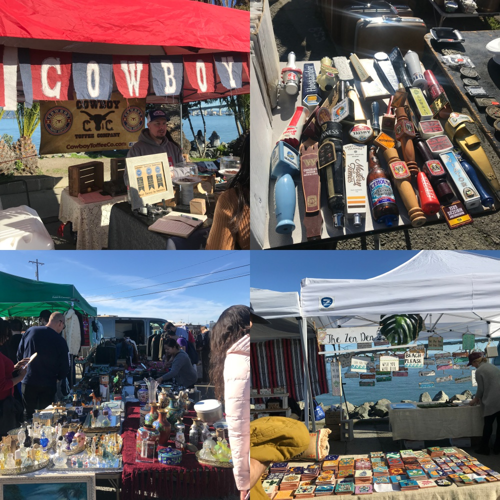
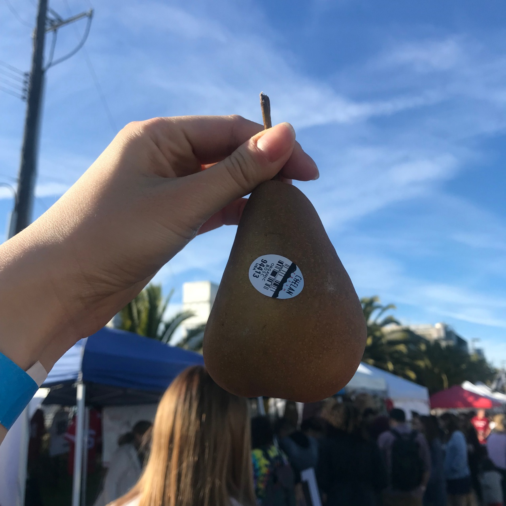

---
layout: post
title : SV_EXPERIENCE - TREASURE ISLAND
--- 

January 28th Sunday

## The NINETH SV_EXPERIENCE (January 28th Sunday)
- Title : _TREASURE ISLAND_
- Date and Time : Sunday, 28 Jan 2018, 13:30 pm ~ 17:00 pm
- Place : Treasure Island, San Francisco, CA
- Attendants : GaeulGo, Seungwoo Jung

## Contents

## 1. Where is the Treasure Island ?

## 2. What did you do in the Treasure Island ?

- When I got off the Uber, I said 'wow'. I can see the bay bridge and the golden gate bridge at a glance.
- The sea was shining by the Sun. So I stood for a while watching the scene of the downtown of San Francisco in front of me.

- (I've saying in every posting but I'm going to use today's posting again) The sky was so beautiful. The gradation from sky blue to white was very good. 

- We are here to see the flea market. As you can see the above picture, it opens in the 4th week every month. We only stay 7 weeks in SF, so it was the last chance to experience the flea market.
- It opens 10am to 4pm. 

- There are many vendors selling clothes, toys, their collection and food they made. Additionally, there are many kinds of food trucks so people can eat and drink they want.
- There are more than 400 vendors and it was great experience to feel the US' culture. 

- I got a pear from the vendor who selling organic food. They provide organic fruits and vegetables in delivering system. I thought it would be good if I have no time to visit the shop.

## 4. Talk our feelings.

- Gaeul Go : I feel I don't have much time to live in San Francisco these days. I have only 3 weeks but I want to enjoy the time remaining participating many events. As time goes by, I really like SF.

