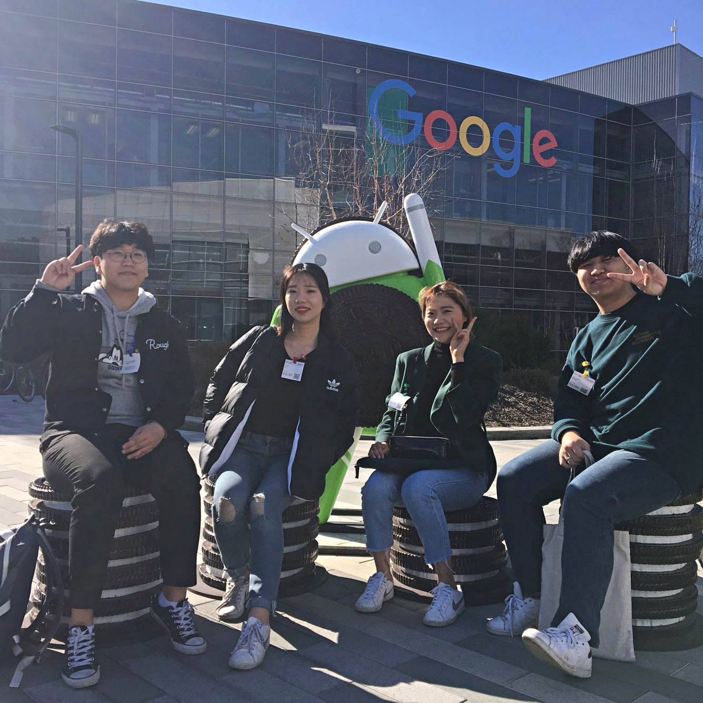
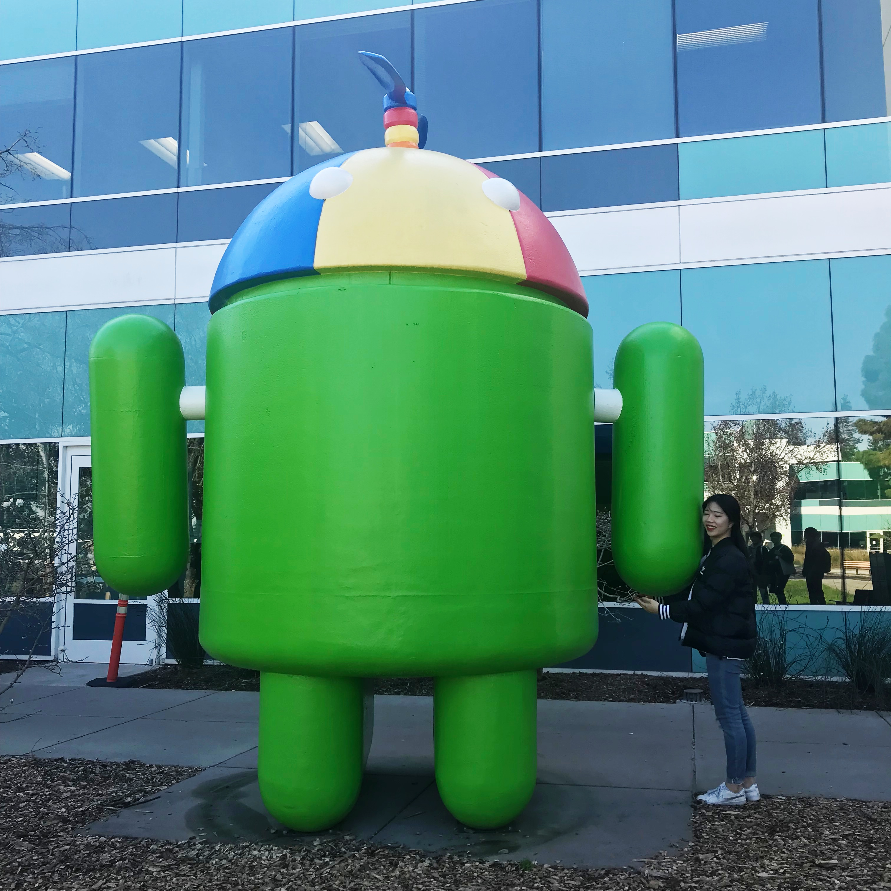
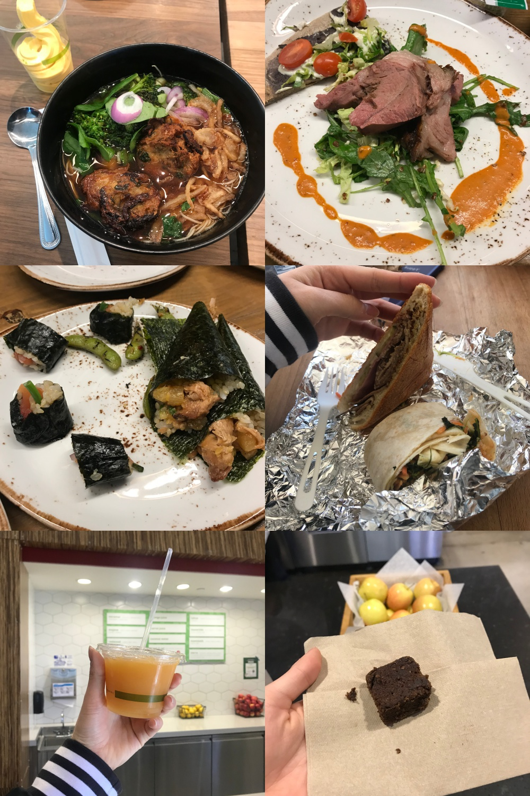
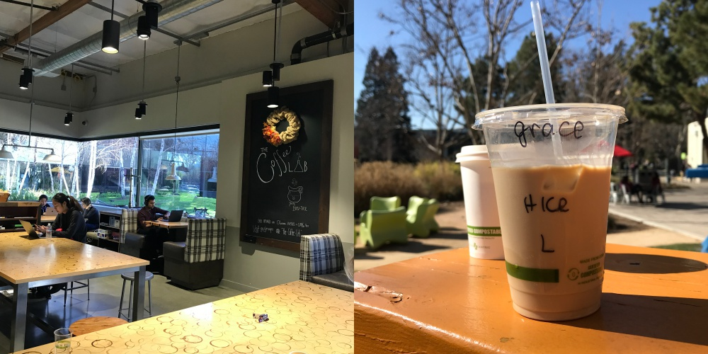
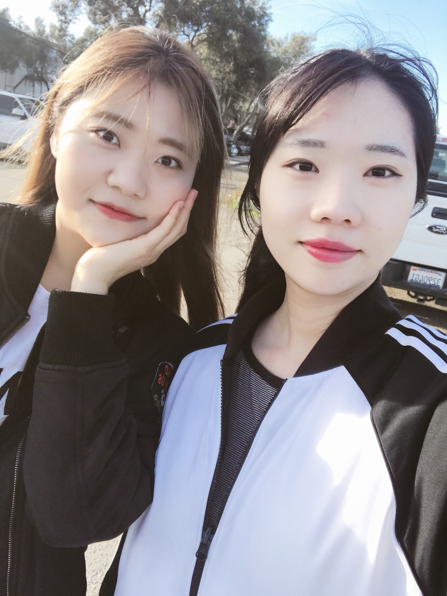

---
layout: post
title : SV_EXPERIENCE - Googleplex
--- 

January 30th Tuesday

## The TENTH SV_EXPERIENCE (January 30th Tuesday)
- Title : _Googleplex_
- Date and Time : Tuesday, 30 Jan 2018, 11:00 am ~ 15:00 pm
- Place : 1600 Amphitheatre Pkwy, Mountain View, CA 94043
- Attendants : GaeulGo, Seungwoo Jung, Hwancheol Kang, Kihyeon Yang

## Contents

## 1. How can we go Goolgleplex ?

- David Lee who gave a mentoring lecture 3 weeks ago, invited us to Googleplex.
- He has passion in his career and it looks nice that he pursues happiness in his life.
- Also, it was a tour we all had dreamed of. 

## 2. What did you do in the Googleplex ?

- David greeted us as soon as we met and we talked our recent conditions. Last 3 weeks, we've changed so much. 
- We completed our demo, went to many places such as golden gate bridge, treasure island, oakland to see basketball and so on. 
- We thought we built up good experiences to tell.

- As we move to other place, Daivd said 'we are going to visit 3 different places to have lunch'.
- His words were true. We ate first lunch at the food truck, second lunch at other restaurants, final lunch at the another restaurants. 
- The surprising thing is that we visited them all and all of them were really good.
- We cannot believe these are all free for the employees. 

- The welfare is really good. After we ate 3 kinds of lunch, we went to google coffee lap. The menu price is not written because it also free for employee. 
- It was great to have Google's attention that allowed employees to concentrate more on work by making sure they had nothing to worry about except for their work.
- Then David told us, "You are free to do things, but you should not lose responsibility for your work."
- Most US start-up company culture is mostly free but it is common to have responsibilty. 
- Also David told us, "There are a lot of great people on google, and I learn a lot when I work with them. And I become enthusiastic not to be harmed by others."
- Without this, David said nice things to us. We really appreciated to David having this opportunity including google tour and saying nice things.

## 4. Talk our feelings.

- Gaeul Go : When I was 2nd year of high school, worker who works in Google had a lecture. His lecture was about his overall life and the procedure of google interview. I thought he was really nice because he entered the global company. At that time, I felt like Google was at a great distance. However, Google is one of my goal and I really want this dream comes true. 
- Hwancheol Kang : I really want to go Google.
- Kihyeon Yang 

