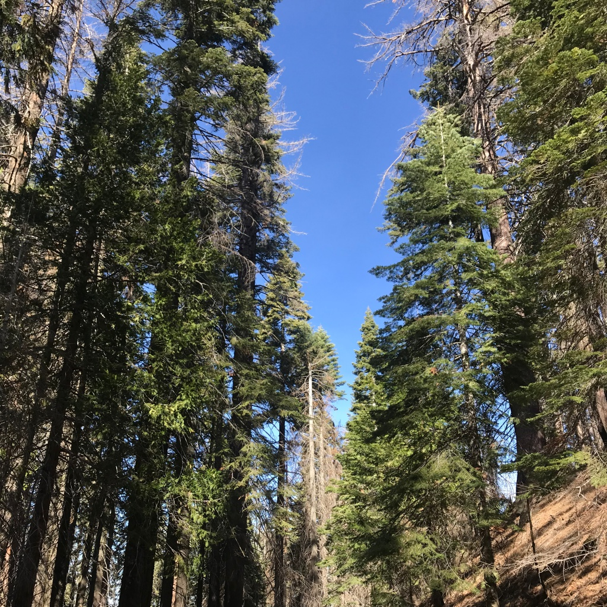
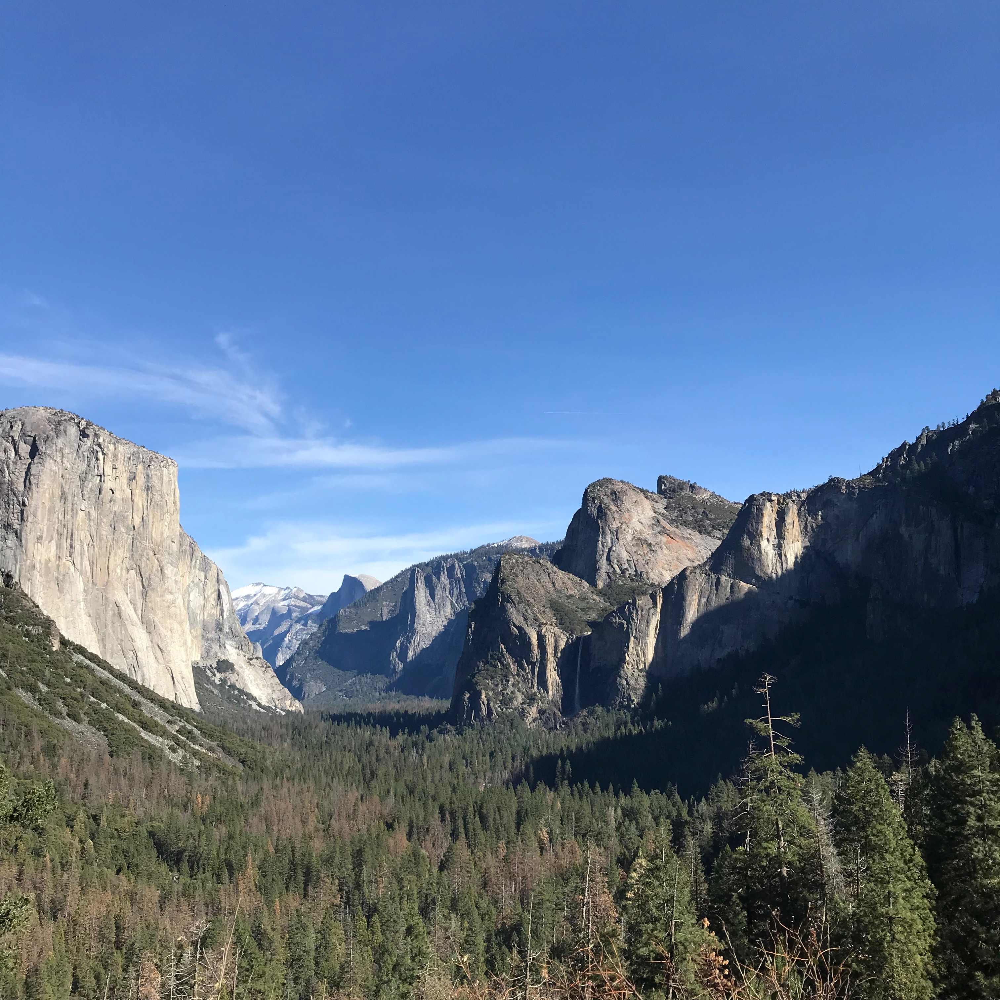
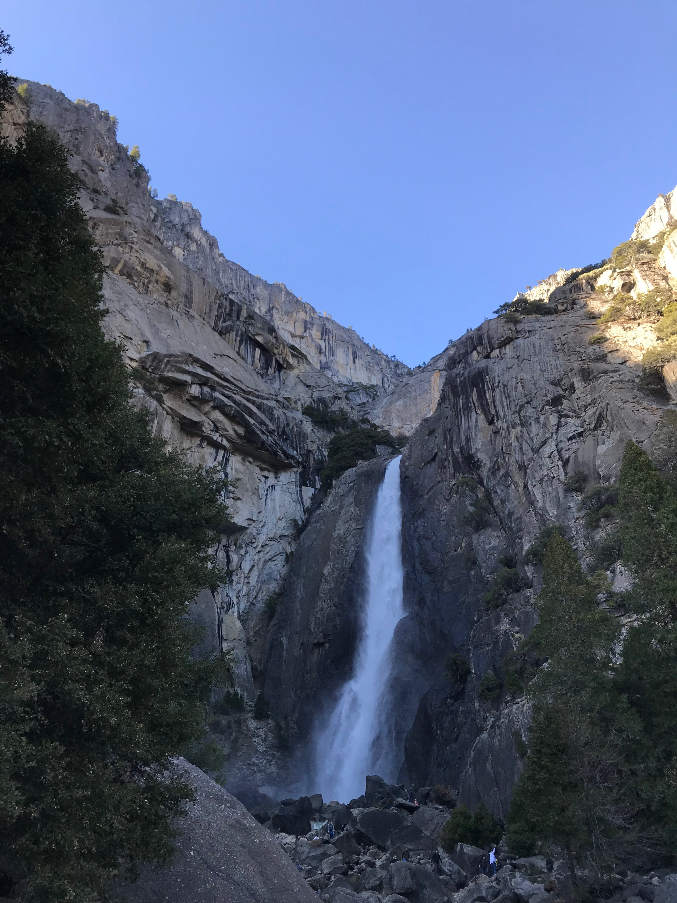
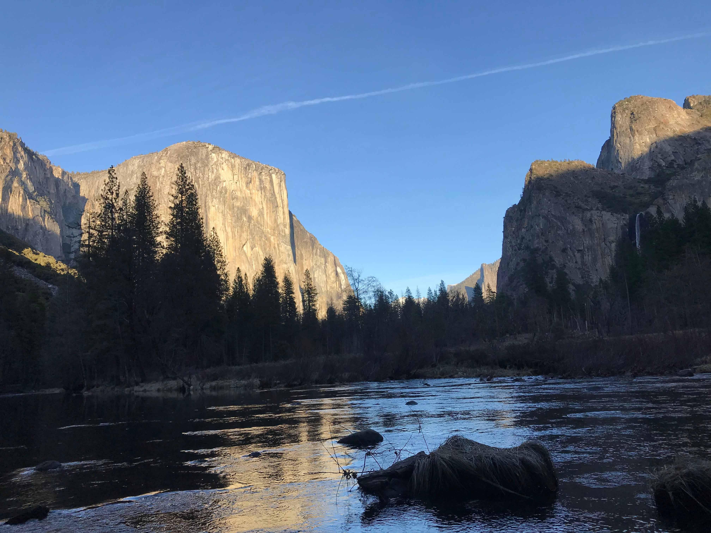
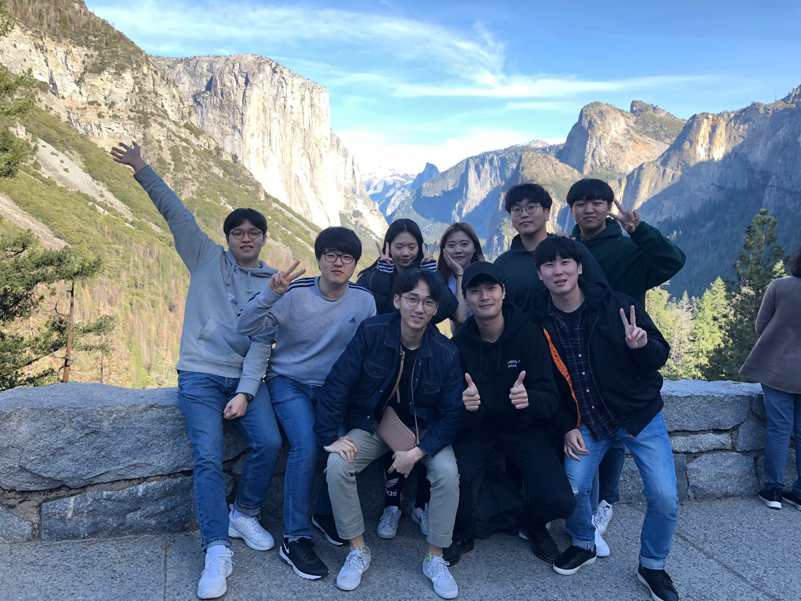

---
layout: post
title : SV_EXPERIENCE - Yosemite
--- 

Febrary 3rd Thursday

## The TENTH SV_EXPERIENCE (Febrary 3rd Saturday)
- Title : _Yosemite_
- Date and Time : Saturday, 3 Feb 2018, 6:00 ~ 21:00
- Place : Yosemite National Park, CA
- Attendants : Alpha team (Gaeul Go, Minjun Koo, Gihyeon Yang, Hwancheol Kang), Quadcore team (Seungwoo Jung, Seunghwan Hong, Hyeongguen Eom, Minjun Cha), Changheon Song

## Contents

## 1. Places we visited
1. Enjoy a 1-hour Sequoia Walk to marvel at the world's tallest trees
2. View the majestic Bridalveil and Yosemite Falls
3. See Inspiration Point, and the amazing El Capitan and Half Dome cliffs

## 2. History of Yosemite.
- Since 1890, beautiful Yosemite National Park has been the jewel of America's National Parks, possessing some of the best–known landmarks in the world, such as the tallest waterfall in North America, Yosemite Falls. 

- Yosemite is home to the spectacular Half Dome & El Capitan, 2 of the most frequently climbed cliffs in the world. 
- It is also home to several groves of stunning Giant Sequoia trees, the largest trees on earth. 
- The Giant Sequoia Walk is along 1 mile (1.5 km) of paved trail with a 400 ft (120 m) incline, snow depth permitting.

## 3. Photos
1. Sequoia Walk

2. Majestic Bridalveil and Yosemite Falls

3. El Capitan and Half Dome cliffs

## 4. Talk our feelings.

- Gaeul Go : It was surprised that I can see the background screen of Macbook. In addition, I could feel Grandeur of nature. 
- Minjun Koo : I am nothing in front of nature.
- Hwancheol Kang : Yosemite was amazing.
- Gihyeon Yang : It was amazed that such a big nature remained.

