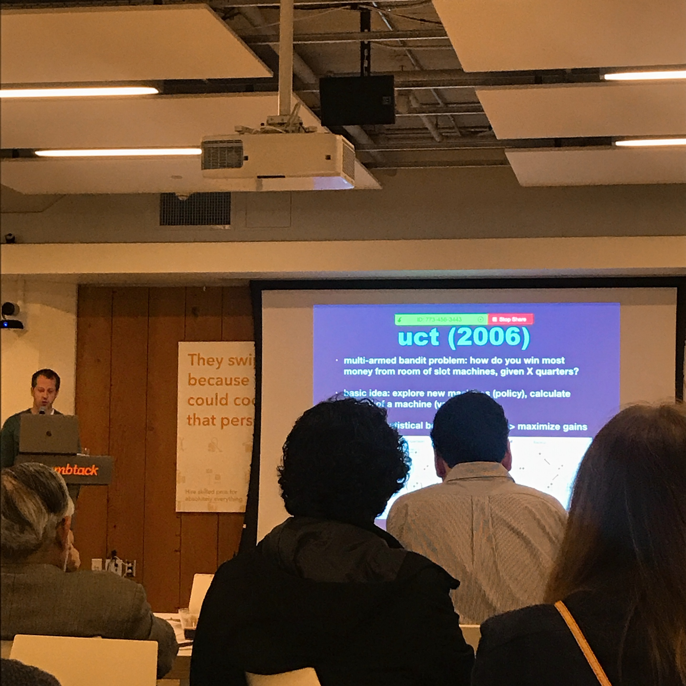
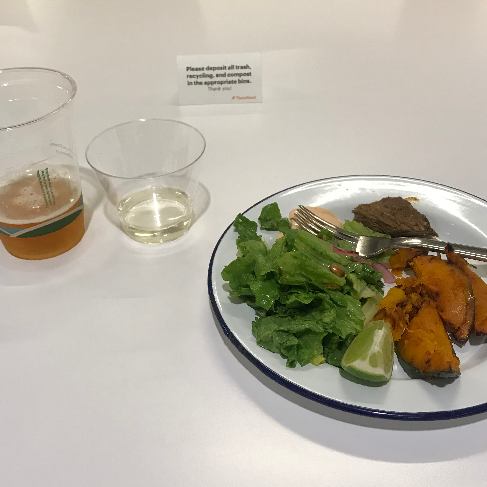
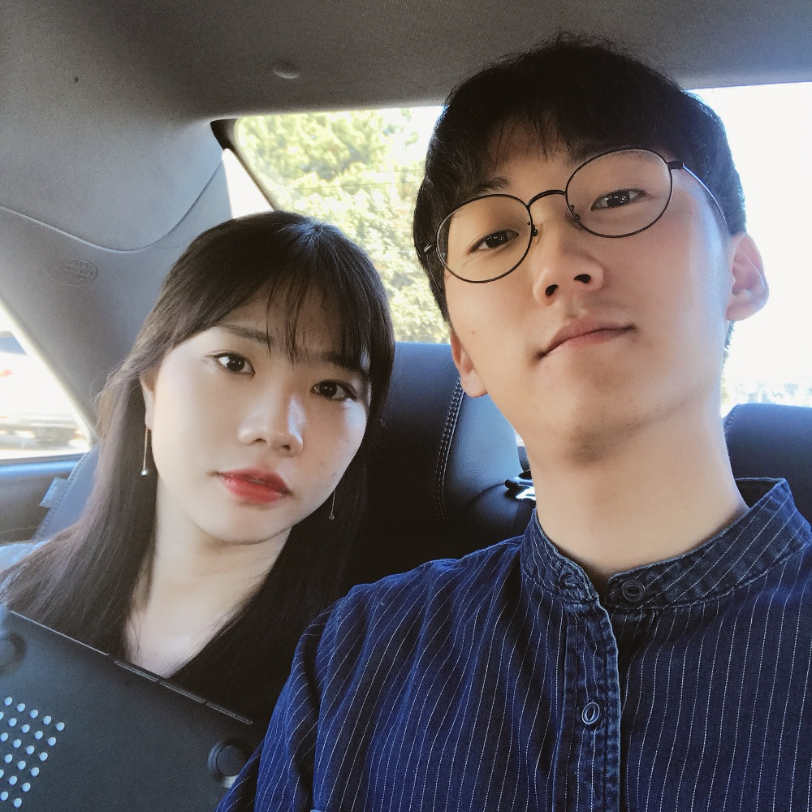

---
layout: post
title : SV_EXPERIENCE - Global Advanced Spark and TensorFlow Meetup
--- 

Febrary 8th Thursday

## The THIRTEENTH SV_EXPERIENCE (Febrary 8th Thursday)
- Title : _Solving Alpha Go Zero + TensorFlow, Kubernetes-based Serverless AI Models on GPU_
- Date and Time : Thursday, 8 Feb 2018, 18:00 am ~ 20:15 pm
- Place : 1355 Market St -- Floor 6 San Francisco, CA 94103
- Attendants : GaeulGo, Minjun Koo

## Contents

## 1. Agenda
 1. Drinks & light 
 2. Talk 0 : Meetup Updates and Announcements by Chris Fregly, Founder & Engineer @ PipelineAI
 3. Talk 1 : Deploying Serverless TensorFlow AI Models and Functions on a Kubernetes Cluster using PipelineAI and OpenFaaS by Chris Fregly, Founder & Engineer @ PipelineAI
 4. Talk 2 : ensorFlow's New(ish) Estimator and Dataset APIs with PipelineAI Community Edition (http://community.pipeline.ai) by Chris Fregly, Founder & Engineer @ PipelineAI
 5. Talk 3 : Alpha Go Zero/AlphaZero with TensorFlow, Probabilistic Methods, and Neural Network Techniques by Brett Koonce (https://www.linkedin.com/in/brettkoonce), CTO @ Quarkworks (https://quarkworks.net/)

## 2. What did we listen in this meet-up

In Talk 3,
- ( I referenced 'http://sanghyukchun.github.io/97/' when I heard the presentation. It explains in Korean.)
- The speaker used play chess when he attended school. He watched alphago and felt interested. 
- He talked about the overview of alpha go. The order is 'discussing game and rules','uct+random rollouts -> MCTS', 'MCTS + policy + value -> Alpha Go' and finally Alpha go zero came out. 
- First of all, he explained the rule of Go ( called 'baduk' in Asia). 
- Secondly, he explained the algorithm called UCT(Upper Confidence Bounds for Trees). 
- Thirdly, he talked about 'random rollouts'. 
- Fourth, he talked about 'alpha go' and the policy network.
- Finally, he talked about 'alpha go zero'. It use single network to predict best move and winning odds. 
( refer : https://applied-data.science/static/main/res/alpha_go_zero_cheat_sheet.png )
- He also talked 'alpha zero' and it teaches self and study. 
- (We can play alpha go zero in here : http://www.alphago-games.com/ )

( We ate dinner here. Koo and I thought if we stay in SF, we would attend meetup every night to meet people and eat dinner. )
- What was different from before, we talked with 2 people when we eat dinner. One was majoring data science and the other was interested in playing alpha go.
- We talked about the environment between Korea and US. We have many thing to say because we experienced directly. 
- We also felt 'we've learned so much because we can talk other people what we're doing'.

## 4. Talk our feelings.

- Gaeul Go : It was quite difficult to me because I don't know well about AI actually. However, it was also important experience because I can experience 
- Minjun Koo : I was surprised to see the AI I learned at school.

